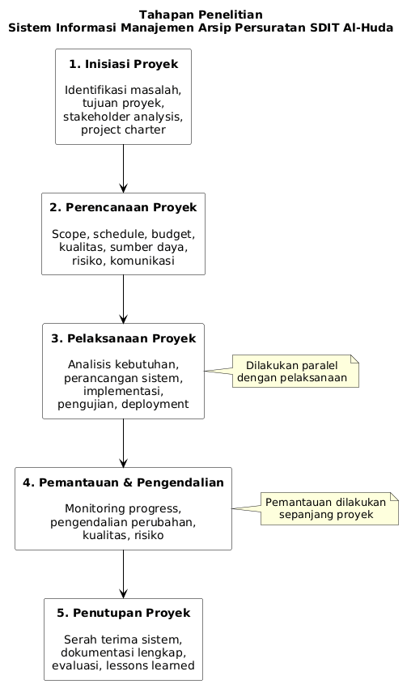

# BAB III  
# METODOLOGI PENELITIAN

## 3.1 Tahapan Penelitian

Penelitian dan pengembangan Sistem Informasi Manajemen Arsip Persuratan di SDIT Al-Huda menggunakan pendekatan System Development Life Cycle (SDLC) dengan model Waterfall. Model ini dipilih karena karakteristik proyek yang memiliki kebutuhan jelas, waktu yang tetap, dan memerlukan dokumentasi yang komprehensif untuk keperluan akademik. Tahapan penelitian terdiri dari lima fase utama yang dilaksanakan secara berurutan dengan keluaran yang terdefinisi jelas di setiap fase.

*Gambar 3.1 Tahapan Penelitian Sistem Informasi Manajemen Arsip Persuratan*

**Uraian Tahapan Penelitian:**

**1. Inisiasi Proyek**

Tahapan ini dimulai dengan mengidentifikasi permasalahan yang dihadapi SDIT Al-Huda dalam pengelolaan arsip persuratan, menentukan tujuan proyek, mengidentifikasi pemangku kepentingan (kepala sekolah, guru, staf administrasi), serta menyusun project charter sebagai dokumen otorisasi formal untuk memulai proyek.

**2. Perencanaan Proyek** 

Tahapan perencanaan mencakup penyusunan ruang lingkup proyek (scope), penjadwalan waktu pengerjaan (timeline), estimasi anggaran biaya, perencanaan kualitas, identifikasi sumber daya yang dibutuhkan, analisis risiko, perencanaan komunikasi, dan strategi pengadaan.

**3. Pelaksanaan Proyek**

Tahapan pelaksanaan merupakan fase inti pengembangan sistem yang terdiri dari:
- Analisis kebutuhan sistem melalui observasi, wawancara, dan studi dokumentasi
- Perancangan sistem meliputi desain basis data, desain antarmuka pengguna, dan diagram UML
- Implementasi sistem menggunakan teknologi web dengan PHP dan MySQL
- Pengujian sistem secara menyeluruh untuk memastikan kualitas dan kesesuaian dengan kebutuhan
- Deployment sistem ke lingkungan produksi

**4. Pemantauan dan Pengendalian Proyek**

Tahapan ini dilakukan paralel dengan pelaksanaan proyek untuk memastikan proyek berjalan sesuai rencana. Aktivitas meliputi pemantauan progres pengerjaan, pengendalian perubahan ruang lingkup, pengendalian kualitas deliverables, dan pengelolaan risiko yang muncul selama pengerjaan.

**5. Penutupan Proyek**

Tahapan akhir mencakup serah terima sistem kepada SDIT Al-Huda, penyusunan dokumentasi lengkap (manual pengguna, dokumentasi teknis), evaluasi pencapaian tujuan proyek, lessons learned, dan pelepasan sumber daya tim proyek.

## 3.2 Tempat dan Waktu Penelitian

### 3.2.1 Tempat Penelitian

Penelitian dan pengembangan sistem informasi ini dilaksanakan di beberapa lokasi sebagai berikut:

**1. SDIT Al-Huda**
   - Lokasi: Sekolah sasaran implementasi sistem
   - Kegiatan: Observasi proses bisnis pengelolaan persuratan, wawancara dengan pemangku kepentingan (kepala sekolah, guru, staf administrasi), dan pengujian penerimaan pengguna (User Acceptance Testing)

**2. Kampus/Lingkungan Pengembangan**
   - Kegiatan: Pengembangan sistem, konsultasi dengan dosen pembimbing, dan koordinasi tim proyek

**3. Secara Daring (Remote/Online)**
   - Kegiatan: Pengembangan sistem, dokumentasi, pengujian, dan koordinasi melalui platform kolaborasi daring

### 3.2.2 Waktu Penelitian

Penelitian ini dilaksanakan selama satu semester akademik dengan rentang waktu sebagai berikut:

**Tabel 3.1 Jadwal Penelitian**

| No | Kegiatan | Durasi | Waktu Pelaksanaan |
|----|----------|--------|-------------------|
| 1 | Inisiasi dan Analisis Kebutuhan | 2 minggu | Minggu 1-2 |
| 2 | Perancangan Sistem | 2 minggu | Minggu 3-4 |
| 3 | Implementasi Sistem | 4 minggu | Minggu 5-8 |
| 4 | Pengujian Sistem | 2 minggu | Minggu 9-10 |
| 5 | Deployment dan Evaluasi | 1 minggu | Minggu 11 |
| 6 | Penyusunan Laporan | 3 minggu | Minggu 12-14 |

Total durasi penelitian adalah **14 minggu** dalam satu semester akademik.

## 3.3 Subjek Penelitian

Subjek penelitian dalam pengembangan sistem informasi manajemen arsip persuratan SDIT Al-Huda terdiri dari pemangku kepentingan yang terlibat langsung dalam pengelolaan persuratan dan yang akan menggunakan sistem.

### 3.3.1 Populasi

Populasi dalam penelitian ini adalah seluruh pengguna potensial sistem informasi manajemen arsip persuratan di SDIT Al-Huda yang terdiri dari:
- Kepala sekolah dan wakil kepala sekolah
- Guru dan tenaga pendidik
- Staf administrasi dan tata usaha
- Administrator sistem

### 3.3.2 Sampel dan Teknik Pengambilan Sampel

Penelitian ini menggunakan teknik purposive sampling (pengambilan sampel bertujuan) dimana sampel dipilih secara sengaja berdasarkan karakteristik dan kriteria tertentu yang sesuai dengan kebutuhan penelitian.

**Tabel 3.2 Distribusi Sampel Penelitian**

| No | Kategori Sampel | Jumlah | Kriteria Pemilihan | Peran dalam Penelitian |
|----|----------------|--------|-------------------|----------------------|
| 1 | Kepala Sekolah | 1 orang | Pengambil keputusan, pengguna disposisi | Memberikan kebutuhan bisnis, validasi sistem, UAT |
| 2 | Wakil Kepala/Guru | 2 orang | Penerima disposisi, pengguna sistem | Memberikan kebutuhan fungsional, pengujian sistem |
| 3 | Staf Administrasi | 2 orang | Pengelola surat masuk/keluar, input data | Memberikan proses bisnis existing, pengujian intensif |
| 4 | Staf TU | 1 orang | Pengelola arsip | Memberikan kebutuhan pengarsipan, UAT |
| **Total** | **6 orang** | | |

Teknik pengambilan sampel menggunakan purposive sampling dengan pertimbangan:
- Sampel dipilih berdasarkan pengetahuan dan pengalaman mereka terhadap proses pengelolaan persuratan di SDIT Al-Huda
- Mewakili berbagai peran pengguna dalam sistem (admin, kepala sekolah, guru, staf)
- Dapat memberikan informasi yang mendalam dan relevan untuk pengembangan sistem
- Bersedia berpartisipasi dalam wawancara, observasi, dan pengujian sistem

## 3.4 Teknik Pengumpulan Data

Pengumpulan data dalam penelitian ini menggunakan pendekatan multi-metode untuk memastikan pemahaman yang komprehensif terhadap kebutuhan sistem dan validasi dari berbagai perspektif. Teknik pengumpulan data yang digunakan meliputi observasi, wawancara, studi pustaka, dan kuesioner.

### 3.4.1 Observasi

Observasi dilakukan untuk memahami proses bisnis aktual yang berjalan di SDIT Al-Huda dan mengidentifikasi permasalahan yang terjadi dalam operasional sehari-hari pengelolaan persuratan. Observasi dilakukan secara langsung di lokasi sekolah dengan mengamati:

- Proses penerimaan dan pencatatan surat masuk
- Proses pembuatan dan pencatatan surat keluar
- Proses disposisi surat dari kepala sekolah kepada guru/staf
- Sistem penyimpanan dan pengarsipan dokumen fisik
- Proses pencarian dan pengambilan arsip
- Interaksi antara staf administrasi dengan pengguna lain

Hasil observasi didokumentasikan dalam catatan lapangan (field notes) yang mencakup aktivitas yang diamati, waktu yang diperlukan, masalah yang ditemukan, dan saran perbaikan. Data observasi digunakan sebagai dasar untuk menyusun diagram proses bisnis (as-is process) yang menggambarkan kondisi sebelum implementasi sistem.

### 3.4.2 Wawancara

Wawancara semi-terstruktur dilakukan untuk mendapatkan informasi mendalam dari pemangku kepentingan mengenai kebutuhan, harapan, dan kendala yang dihadapi dalam sistem pengelolaan persuratan yang sedang berjalan. Wawancara dilakukan kepada:

**Tabel 3.3 Daftar Narasumber Wawancara**

| No | Narasumber | Jumlah | Tujuan Wawancara |
|----|-----------|--------|------------------|
| 1 | Kepala Sekolah | 1 orang | Memahami visi pengembangan sekolah, kebutuhan monitoring dan pelaporan, ekspektasi terhadap sistem disposisi |
| 2 | Staf Administrasi | 2 orang | Memahami proses detail pengelolaan surat masuk/keluar, kendala yang dihadapi, kebutuhan fitur sistem |
| 3 | Guru/Wakil Kepala | 2 orang | Memahami kebutuhan penerima disposisi, akses informasi surat, dan pelaporan tindak lanjut |
| 4 | Staf TU/Arsip | 1 orang | Memahami sistem pengarsipan, pencarian dokumen, dan kebutuhan penyimpanan digital |

Wawancara dilakukan dengan durasi 30-45 menit per narasumber menggunakan panduan wawancara yang telah disiapkan. Hasil wawancara didokumentasikan dalam bentuk transkrip wawancara dan dianalisis untuk mengidentifikasi kebutuhan fungsional dan non-fungsional sistem.

### 3.4.3 Studi Pustaka

Studi pustaka dilakukan untuk membangun landasan teoritis dan memahami best practice dalam pengembangan sistem informasi manajemen arsip persuratan. Sumber pustaka yang digunakan meliputi:

- Jurnal ilmiah tentang sistem informasi manajemen arsip dan persuratan
- Buku referensi tentang rekayasa perangkat lunak dan manajemen proyek
- Undang-undang dan peraturan tentang kearsipan (UU No. 43 Tahun 2009 tentang Kearsipan)
- Dokumentasi teknis teknologi yang digunakan (PHP, MySQL, Tailwind CSS)
- Penelitian terdahulu tentang sistem informasi persuratan di lembaga pendidikan

Studi pustaka menghasilkan tinjauan literatur yang disajikan dalam BAB II dan menjadi dasar dalam perancangan dan pengembangan sistem.

### 3.4.4 Kuesioner

Kuesioner digunakan untuk mengumpulkan data kuantitatif dari sampel yang lebih luas dan mengukur tingkat kepuasan serta kegunaan sistem. Kuesioner dibagikan dalam dua tahap:

**1. Kuesioner Analisis Kebutuhan**
   - Diberikan kepada calon pengguna sistem (10 responden)
   - Bertujuan mengidentifikasi fitur yang dibutuhkan dan prioritasnya
   - Mengukur tingkat kesulitan yang dihadapi dengan sistem manual
   - Mengukur kesiapan pengguna terhadap sistem digital

**2. Kuesioner Evaluasi Sistem**
   - Diberikan kepada partisipan pengujian setelah menggunakan sistem (6 responden)
   - Mengukur tingkat kegunaan sistem dengan metode System Usability Scale (SUS)
   - Mengukur kepuasan pengguna terhadap fitur dan antarmuka
   - Mengidentifikasi area perbaikan untuk pengembangan selanjutnya

Hasil kuesioner dianalisis secara deskriptif dan statistik untuk mendukung pengambilan keputusan dalam pengembangan sistem.

### 3.4.5 Studi Dokumentasi

Studi dokumentasi dilakukan dengan mengumpulkan dan menganalisis dokumen-dokumen terkait pengelolaan persuratan di SDIT Al-Huda, meliputi:

- Buku agenda surat masuk dan surat keluar
- Contoh format surat-surat yang digunakan
- Prosedur operasional standar (SOP) pengelolaan surat
- Struktur organisasi dan pembagian tugas
- Laporan-laporan persuratan yang pernah dibuat

Data dari studi dokumentasi digunakan untuk memahami format dan struktur data yang sudah ada, serta sebagai acuan dalam merancang struktur basis data dan format tampilan sistem.